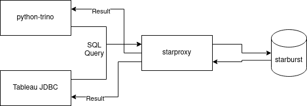

# starproxy

> :warning: **`starproxy` is a prototype**: Not currently used in production, but will likely be some day.

## Table of Contents

- [starproxy](#starproxy)
  - [Table of Contents](#table-of-contents)
  - [Background](#background)
  - [How it works](#how-it-works)
  - [Run \&\& Development](#run--development)
  - [Implemented Rules](#implemented-rules)
  - [Future work](#future-work)

## Background

`starproxy` is a fully HTTP compliant proxy that is designed to sit between clients and a Trino/Starburst cluster. The motivation for developing a solution like this is laid out in some prior art below:

- [Facebook Engineering Blog - Static Analysis](https://engineering.fb.com/2022/11/30/data-infrastructure/static-analysis-sql-queries/)
- [Strata Conference Talk](https://conferences.oreilly.com/strata/strata-ca-2018/public/schedule/detail/63709.html)
- [Uber Case Study - Prism](https://www.youtube.com/watch?v=0NwUCvOZuHY)

The most attractive items to us are probably:

- enabling host based security
- detecting "bad" queries and blocking/deprioritizing them with custom rules
- load balancing across regions

## How it works

First and foremost, `starproxy` is an http proxy implemented in `rust` using a combination of `axum/hyper`.

The choice of Rust for the backend is two-fold:

1) Speed, we want to avoid adding appreciable measurable latency to end user requests. If a query is not subject to any rules/actions then the proxy should quickly forward the request to the destination as normal.
2) Rust has excellent libraries for parsing SQL grammar, in this case we are using `sqlparser-rs`, which allows us to very quickly parse the AST of the query and use it as input for rules. This allows us to craft rules that understand the structure of the query, not just match some logic w/ regular expressions.



1) Parse the query AST, then check a variety of rules

- inbound CIDR rule checking
- checking for predicates in queries
- identifying select * queries with no limit, among other rules

2) If rules are violated they can be associated with actions, like tagging the query as low priority. This is done by modifying the request headers and injecting special tags.

Rules can also outright block requests by returning error status codes to the client directly.

## Run && Development

To run `starproxy` locally, you first need to install the rust toolchain. Then, you can run

```sh
export STARPROXY_CONFIG_PATH=./config.json
export STARPROXY_UPSTREAM_URL=https://your.cluster.company.dev
cargo run
```

This will spin up the web app on port 3000, serving only HTTP.

> :warning: `starproxy` does not itself do SSL termination, you'll need an additional reverse proxy or hopefully your PaaS platform is providing an SSL cert (like a k8s Ingress or OpenShift Route). If you don't serve this proxy w/ SSL termination then the `OAuthProvider` for trino/starburst will likely not work for authentication. You've been warned!

## Implemented Rules

For this prototype we've implemented a handful of rules:

- `WhereClause` - If a query contains a specific table reference, ensure an associated where clause is in that query
- `SelectStarNoLimit` - If a query contains a select *, enforce that a LIMIT is applied. If not, put it in low priority queue
- `CidrOrigin` - A basic implmenetation of host based security, leveraging the `x-forwarded-ip` header
- `ScanEstimates` - A basic implementation of a rule that runs an `EXPLAIN` on the query, and then takes action based on the projected cost.

An example config file is bundled with the repo 

If you have an idea for a rule that you'd like to see implemented, feel free to open a GitHub issue!

## Future work

Write a rule + action that actually rewrites the body of the query, instead of modifying the request headers. If this is done, we should probably inject a warning so the client is notified that this ocurred.

Train a machine learning model (likely something like XGBoost) to do query performance classification using historical performance data. Identify likely offensive queries and proactively classify them without needing an admin to define rules.

Make "actions" more configurable. Right now actions are bound to rules at compile time, not at config generation time. Actions also deserve first class support in the config generation for stuff like parameters.

Allow wildcard or regex specifiers for tables to make rules more flexible.

Load balance / route queries between multiple clusters, to be used if the backing cluster footprint is HA or multi-az. It would be very nice to treat routing as an action, or even chain actions together. Like rewriting a query to add a limit and then sending it to a cluster designed to only support adhoc "exploration" type queries.
